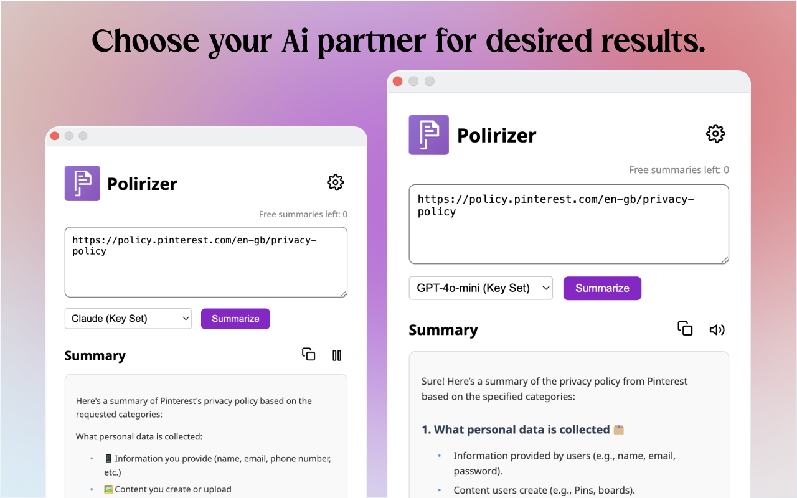
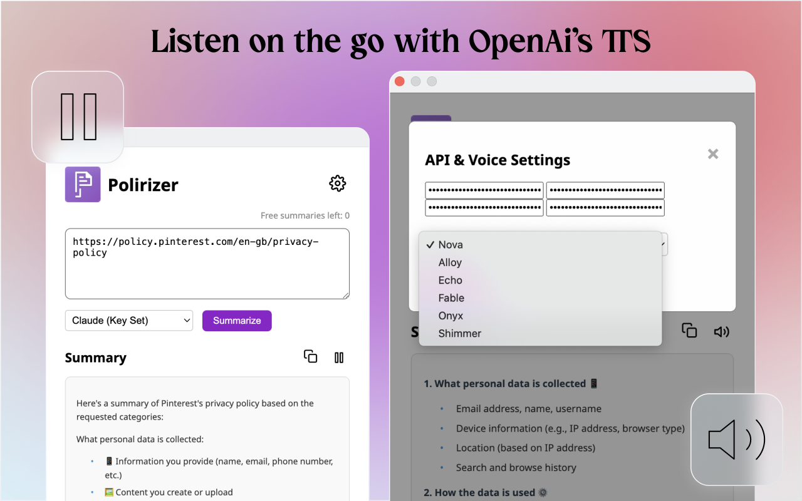

# Polirizer Chrome Extension

## Overview
Polirizer is a Chrome extension designed to summarize privacy policies and terms of service documents. It uses advanced AI models to provide concise, easy-to-understand summaries of lengthy legal documents, making it easier for users to understand their rights and obligations.

## Features
- Summarize privacy policies and terms of service from any website
- Support for multiple AI models (GPT, Claude, Gemini)
- URL and text input support
- Customizable API key settings
- Copy, text-to-speech, and export functionalities for summaries
- User-friendly interface with error handling and loading indicators
- Session-based activity tracking for personalized experience
- Celebratory confetti effect for new users

## Installation
1. Clone this repository or download the source code.
2. Open Chrome and navigate to `chrome://extensions/`.
3. Enable "Developer mode" in the top right corner.
4. Click "Load unpacked" and select the directory containing the extension files.

## Usage
1. Click on the Polirizer icon in your Chrome toolbar.
2. Enter a URL or paste the text of a privacy policy/terms of service.
3. Select your preferred AI model.
4. Click "Summarize" to generate a summary.
5. Use the provided options to copy, listen to, or export the summary.

## Configuration
- API Keys: Enter your API keys for different AI models in the settings menu.
- Model Selection: Choose between GPT, Claude, and Gemini models for summarization.

## Development
To set up the development environment:

1. Ensure you have Node.js and npm installed.
2. Run `npm install` to install dependencies.
3. Use `npm run build` to build the extension.
4. For development with hot-reloading, use `npm run dev`.
5. Backend setup 'https://github.com/sahaib/PolirizerBackend'

## Testing
- Run unit tests with `npm test`.
- For end-to-end testing, use `npm run e2e`.

## Acknowledgments
- Thanks to Cursor IDE who have helped shape Polirizer.
- Special thanks to the open-source community for the tools and libraries used in this project.

## Security
If you discover any security-related issues, please email hello@sahaibsingh.com instead of using the issue tracker.

## Privacy
Polirizer is committed to user privacy. For details on data handling and privacy practices, please refer to our [Privacy Policy](PrivacyPolicy.md).

## App Preview

