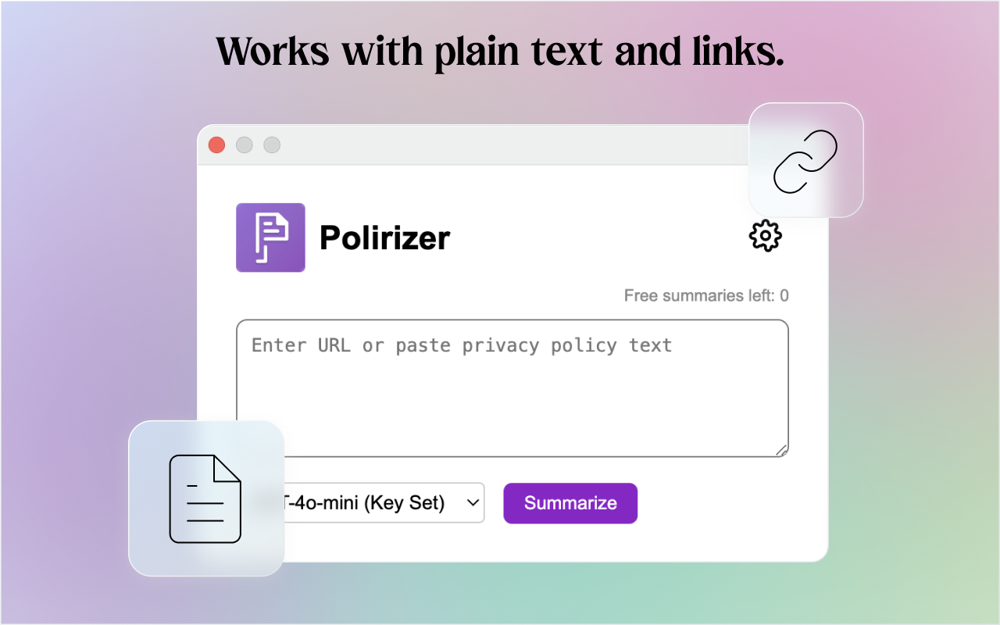

# Polirizer

Polirizer is a Chrome extension that summarizes privacy policies using AI technology. It provides quick, easy-to-understand summaries of complex privacy policies, helping users make informed decisions about their online privacy.

## Features

- Summarize privacy policies from URLs or pasted text
- Support for multiple AI models including GPT-4o-mini, Claude, Gemini, and Mistral
- Text-to-speech functionality for audio summaries
- Customizable settings for API keys and voice selection
- User-friendly interface with copy and audio playback options

## Installation

1. Clone this repository or download the ZIP file.
2. Open Chrome and navigate to `chrome://extensions/`.
3. Enable "Developer mode" in the top right corner.
4. Click "Load unpacked" and select the directory containing the extension files.

## Usage

1. Click on the Polirizer icon in your Chrome toolbar.
2. Enter a URL of a privacy policy or paste the policy text directly.
3. Select the AI model you want to use for summarization.
4. Click "Summarize" to generate a summary.
5. Use the copy button to copy the summary or the audio button to listen to it.

## Configuration

- API Keys: Enter your API keys for different AI models in the settings menu.
- Voice Selection: Choose your preferred voice for text-to-speech in the settings.

## Development

To set up the development environment:

1. Clone the repository: `git clone https://github.com/yourusername/polirizer.git`
2. Navigate to the project directory: `cd polirizer`
3. Install dependencies (if any): `npm install`

## Contributing

Contributions are welcome! Please feel free to submit a Pull Request.

## License

This project is licensed under the [MIT License](LICENSE).

## Disclaimer

Polirizer is for informational purposes only. Always read the full privacy policy for complete information.

## App Preview

